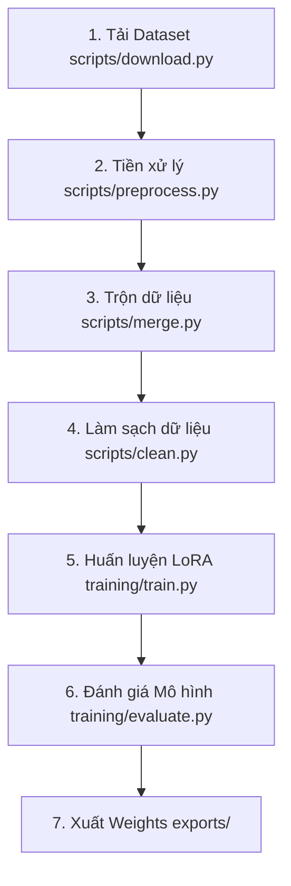

# AI Grammar Error Correction (GEC) Training Framework

Thư mục này chứa toàn bộ hệ thống chuẩn bị dữ liệu, huấn luyện (fine-tune) và đánh giá mô hình sửa lỗi ngữ pháp (Grammar Error Correction) dành cho ứng dụng **AppLearnEnglish**.

Dự án này sử dụng mô hình base **FLAN-T5-Base** và áp dụng phương pháp hiệu chỉnh tham số hiệu quả **LoRA (Low-Rank Adaptation)** để tối ưu tài nguyên tính toán.

---

## 📂 Cấu trúc Thư mục (Project Structure)

```text
AI/
├── datasets/                   # Dữ liệu phục vụ huấn luyện và đánh giá
│   ├── raw/                    # Dữ liệu gốc tải về (chưa qua xử lý)
│   ├── processed/              # Dữ liệu sạch sau tiền xử lý (train.jsonl, validation.jsonl...)
│   └── logs/                   # Thư mục logs (preprocess_report.txt)
│
├── scripts/                    # Scripts công cụ xử lý dữ liệu
│   ├── download.py             # Lớp quản lý DatasetManager & Lệnh tải dữ liệu
│   ├── preprocess.py           # Pipeline tiền xử lý chính
│   ├── merge.py                # Wrapper hợp nhất tích hợp
│   └── clean.py                # Wrapper làm sạch tích hợp
│
├── parsers/                    # Các parser xử lý tệp tin GEC thô
│   ├── base_parser.py          # Lớp trừu tượng BaseParser
│   ├── jfleg_parser.py         # Parser cho JFLEG JSON
│   ├── fce_parser.py           # Parser cho FCE M2/txt
│   └── bea_parser.py           # Parser cho BEA M2/txt
│
├── training/                   # Core pipeline huấn luyện & suy luận
│   ├── train.py                # Script huấn luyện chính (fine-tune FLAN-T5 với LoRA)
│   ├── evaluate.py             # Script đánh giá mô hình bằng chỉ số GLEU / BLEU / Rouge
│   ├── inference.py            # Chạy thử mô hình bằng CLI (kiểm tra tính năng thực tế)
│   └── config.py               # Các siêu tham số huấn luyện
│
├── checkpoints/                # Lưu trạng thái weights trung gian trong quá trình huấn luyện
├── exports/                    # Lưu mô hình LoRA cuối cùng
│
├── requirements.txt            # Thư viện Python phụ thuộc
└── README.md                   # Tài liệu hướng dẫn sử dụng (Tệp tin này)
```

---

## 🛠️ Hướng dẫn Cài đặt Môi trường (Environment Setup)

Dự án yêu cầu **Python 3.12** trở lên và đã kiểm thử trên PyTorch.

1. **Khởi tạo môi trường ảo (Virtual Environment)**:
   ```bash
   cd AI
   python3.12 -m venv venv
   source venv/bin/activate
   ```

2. **Cài đặt các gói phụ thuộc (Dependencies)**:
   ```bash
   pip install --upgrade pip
   pip install -r requirements.txt
   ```

---

## 🔄 Quy trình Huấn luyện & Phát triển (ML Pipeline)



### Bước 1: Chuẩn bị Dữ liệu
1. **Tải dữ liệu thô**: Tải các bộ dữ liệu GEC phổ biến (BEA-2019, FCE, JFLEG).
   
   * **Danh sách các Dataset hỗ trợ**:
     - `jfleg`: JFLEG (Tự động tải từ Hugging Face Hub).
     - `fce`: FCE Cambridge (Tự động tải file `.tar.gz` từ Đại học Cambridge và tự giải nén).
     - `bea`: BEA-2019 Shared Task (Tải thủ công - hiển thị hướng dẫn khi chạy lệnh).
     - `lang8`: Lang-8 Learner Corpus (Tải thủ công).
     - `gyafc`: GYAFC Formality Corpus (Tải thủ công).

   * **Liệt kê danh sách Dataset hỗ trợ**:
     ```bash
     python scripts/download.py --list
     ```

   * **Chạy tải tự động**:
     Ví dụ để tải JFLEG và FCE tự động:
     ```bash
     python scripts/download.py --dataset jfleg
     python scripts/download.py --dataset fce
     ```

   * **Xác thực trạng thái (Audit) toàn bộ Dataset**:
     Kiểm tra dung lượng file, định dạng, số mẫu của Train/Val/Test hiện có:
     ```bash
     python scripts/download.py --verify-all
     ```

   * **Cấu trúc thư mục dữ liệu sau khi tải**:
     Chạy tải sẽ tạo ra cấu trúc thư mục dạng:
     - `datasets/raw/downloads/`: Thư mục cache chứa các file nén đã tải về.
     - `datasets/raw/jfleg/`: Chứa file `train.json`, `validation.json`, `test.json` sau khi tải.
     - `datasets/raw/fce/`: Chứa file FCE đã giải nén.

2. **Tiền xử lý, Hợp nhất & Làm sạch dữ liệu**:
   
   Hệ thống tự động nạp dữ liệu thô từ thư mục `datasets/raw/` bằng các Parser tương ứng:
   - `JFLEGParser`: Trích xuất input/output từ JSON.
   - `FCEParser` & `BEAParser`: Trích xuất và tái tạo câu đúng từ định dạng sửa lỗi M2 (edit offsets).

   * **Quy trình xử lý tự động**:
     - Chuẩn hóa Unicode NFKC.
     - Loại bỏ các ký tự điều khiển (Control characters).
     - Loại bỏ khoảng trắng thừa.
     - Lọc bỏ các cặp câu trùng lặp, câu rỗng.
     - Loại bỏ câu quá dài (vượt quá 150 tokens hoặc 1000 ký tự).
     - Hỗ trợ loại bỏ các câu không có lỗi (câu mà `input == target`) nếu cấu hình bật (`PreprocessConfig.EXCLUDE_IDENTICAL`).

   * **Chia tách dữ liệu tự động**:
     - Đối với các bộ dữ liệu không chia sẵn tập dữ liệu (unsplit), hệ thống tự động chia theo tỷ lệ **Train 80%**, **Validation 10%**, **Test 10%** dựa trên seed ngẫu nhiên cố định (`42`).

   * **Chạy lệnh tiền xử lý**:
     ```bash
     python scripts/preprocess.py
     ```

   * **Ý nghĩa các file đầu ra sinh ra**:
     Lệnh trên sẽ tự động đọc, gộp, làm sạch và ghi đè 3 tệp tin JSON Lines bên trong thư mục `datasets/processed/`:
     - `train.jsonl`: Dữ liệu huấn luyện, mỗi dòng định dạng: `{"input": "Fix grammar: <câu_sai>", "target": "<câu_đúng>", "source": "<dataset>"}`.
     - `validation.jsonl`: Dữ liệu kiểm thử đánh giá nhanh.
     - `test.jsonl`: Dữ liệu đánh giá cuối cùng.

   * **Xem báo cáo thống kê**:
     Sau khi chạy, một tệp tin báo cáo thống kê chi tiết (Số lượng mẫu thô, số mẫu trùng lặp, số mẫu bị lọc bỏ, chiều dài trung bình...) sẽ được tự động tạo tại:
     - `datasets/logs/preprocess_report.txt`

### Bước 2: Chuẩn bị Dataset & Tokenization Pipeline
Trước khi huấn luyện, dữ liệu được tải từ các file JSON Lines (`.jsonl`) sạch và tự động mã hóa (tokenize) thông qua thư viện PyTorch Dataset:
* **Cấu trúc hoạt động**:
  - `GrammarCorrectionDataset`: Lớp Wrapper kế thừa `torch.utils.data.Dataset` đọc các cặp câu và sử dụng tokenizer của `google/flan-t5-base`.
  - Tự động cắt ngắn (truncation) hoặc đệm (padding) các token về độ dài cố định `128` (hoặc cấu hình tùy chỉnh).
  - Áp dụng kỹ thuật che đệm (labels masking): Các token đệm trong labels được thay thế bằng giá trị `-100` để PyTorch's `CrossEntropyLoss` bỏ qua khi tính toán hàm loss.
  - Các hàm tiện ích: `load_train_dataset()`, `load_validation_dataset()`, `load_test_dataset()` và `get_dataset_statistics()`.

* **Chạy kiểm thử Dataset Pipeline**:
  Xác minh dữ liệu tải thành công, tokenize chuẩn xác và hiển thị biểu đồ phân bổ độ dài token:
  ```bash
  python training/test_dataset.py
  ```

### Bước 3: Huấn luyện Mô hình (Fine-Tuning)
Mô hình sẽ huấn luyện qua thư viện `transformers` tích hợp `peft` để chỉ cập nhật trọng số adapter LoRA, tiết kiệm VRAM.
* Chạy huấn luyện:
  ```bash
  python training/train.py
  ```
  *(Các checkpoint sẽ được lưu tự động trong thư mục `checkpoints/`)*.

### Bước 3: Đánh giá & Suy luận (Evaluation & Inference)
1. **Chạy đánh giá**: Tính toán độ hao hụt (Loss) và các chỉ số GLEU / Rouge trên tập dữ liệu kiểm thử độc lập (`datasets/evaluation/`).
   ```bash
   python training/evaluate.py
   ```
2. **Suy luận trực tiếp (Demo CLI)**: Kiểm tra nhanh khả năng sửa câu của mô hình đã train:
   ```bash
   python training/inference.py --text "I go to school yesterday."
   ```

### Bước 4: Xuất mô hình (Export)
* Sau khi hoàn tất huấn luyện, weights cuối cùng sẽ được xuất ra thư mục `exports/` dưới dạng adapter LoRA sẵn sàng cho việc tích hợp vào Backend phục vụ suy luận thực tế (inference API).
